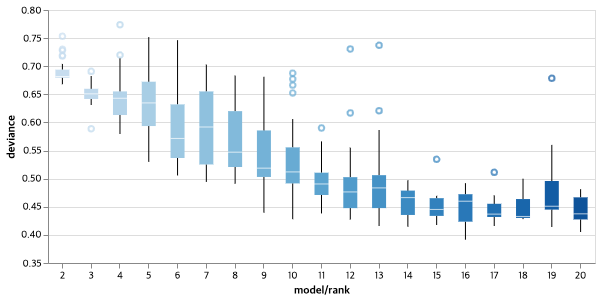

# TensorSignature-PyTorch

It is PyTorch implementation of [TensorSignature](https://tensorsignatures.readthedocs.io/).
It is based on the PyTorch Lightning and Hydra configurations.
You can run the code with one of the configurations saved at [configs/experiment](configs/experiment).

## Train and Test
```bash
python run.py experiment=<config_file_name>
```

Especially, the logger used in the code is [**wandb**](https://wandb.ai/). So you need the **wandb** account in advance.


## Note
- The original code trains each parameters with full batch schema. But, this code is based on stochastic gradient method.
- The original code doesn't have any stopping criteria. But we separated validation set (~about 10%~) and applied 'Earyly Stopping Criteria'.

## Result

### TS data

